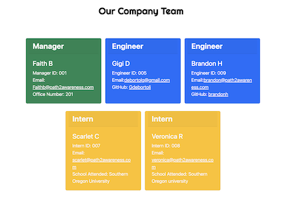
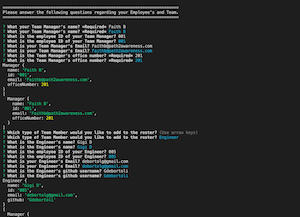
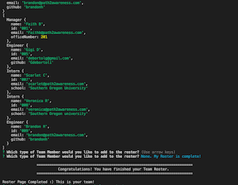

# Employee Team Profile Generator

## Description

Command-line application that takes in information about employees on a software engineering team and generates an HTML webpage that displays summaries for each person. 

### User Story

AS A manager I WANT to generate a webpage that displays my team's basic info
SO THAT I have quick access to their emails and GitHub profiles

## Table of Contents

- [Objectives](#objectives)
- [Assets](#assets)
- [Installation](#installation)
- [Walkthrough Videos](#walkthrough-videos)
- [Screenshots](#screenshots)
- [Github Link](#github-link)

## Objectives

Create a command-line application that accepts user input with the following criteria:

* WHEN I am prompted for my team members and their information THEN an HTML file is generated that displays a nicely formatted team roster based on user input
* WHEN I click on an email address in the HTML THEN my default email program opens and populates the TO field of the email with the address
* WHEN I click on the GitHub username THEN that GitHub profile opens in a new tab
* WHEN I start the application THEN I am prompted to enter the team manager’s name, employee ID, email address, and office number
* WHEN I enter the team manager’s name, employee ID, email address, and office number THEN I am presented with a menu with the option to add an engineer or an intern or to finish building my team
* WHEN I select the engineer option THEN I am prompted to enter the engineer’s name, ID, email, and GitHub username, and I am taken back to the menu
* WHEN I select the intern option THEN I am prompted to enter the intern’s name, ID, email, and school, and I am taken back to the menu
* WHEN I decide to finish building my team THEN I exit the application, and the HTML is generated

## Assets

* node.js
* inquirer.js
* jest 
* screencastify 
* path.js
* bootstrap
* google fonts 

## Installation

* Clone the repository
* run $ npm install in command line
* run $ nodemon server to start the server 

## Walkthrough Videos

* [Terminal Demo Video](https://watch.screencastify.com/v/HXbY8fAdCvWQRmusHE1O)
* [Jest Tests Video](https://watch.screencastify.com/v/BWWnC9g5K98uwZqJflbq)
* [Html Page Creation Walkthrough Video](https://watch.screencastify.com/v/C9ESOxQzentYj3YPraf5)

## Screenshots

* HTML Employee Roster

* Command Line Screenshots

## Github Link

Click here for the link to my [Github Respository](https://github.com/Gdebortoli/team-profile-generator-10.git) 
